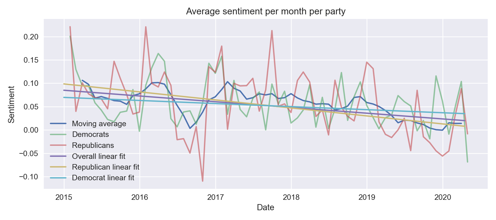

# Evolution of the political cleavage in the USA

Donald Trump's election in 2017 was only one illustration of the Left-Right political cleavage in the United States of America. Leveraging the [Quotebank dataset](https://zenodo.org/record/4277311), we propose to measure the evolution of this cleavage across time, and especially focus on how major elections i.e. the presidential election or midterms affect the cleavage short-term between January 2015 and April 2020. We're expecting this cleavage to increase, specially around events such as the presidential election or some specific events like the outbreak of the corona epidemic (2020), [major mass shootings](https://en.wikipedia.org/w/index.php?title=List_of_mass_shootings_in_the_United_States&oldid=1054289389), the first impeachment of Trump (2019), the riot in Charlottesville (2017). We are not looking at events from 2021, and hence, the January 6th riots and Joe Biden taking office are omitted.

The political cleavage is measured through a sentiment analysis over the quotes from contemporary political members of the republican and democratic parties targeting members of the other party.

## Overall look
Sections 2 and 3.1 of sentiment_eda  
How is the data distributed (per party directly or just all quotes altogether), seems to be random, average of 0 over time. Really the case? 
Also include examples of very negative and positive quotes 

Now, let's get our hands dirty! What are we facing? Here are a few statistics on the dataset we'll analyze:
(should be made colorful, add animation when scrolling? Made into "small cards", each containing one row?)
- More than **100k quotes** said by **776** unique US politicians
- From them, democrats were quoted **49k** times, and republicans **56k**
- Wow! Republicans seem to talk a lot. Really? Trump was quoted... **23k** times
- The next most quoted speaker is Hillary Clinton with more than **4.5k** quotes
- The overall sentiment score is **0.047**
- Democrats seem to be a bit more positive with an average score of **0.049**, while  republicans have an average score of **0.044** - and the values are significantly different at the 10 % level
- The most positive quote is attributed to...  **[Elizabeth Warren](https://en.wikipedia.org/wiki/Elizabeth_Warren)** (Dem.)
- And the most negative to... **[Kevin McCarthy](https://en.wikipedia.org/wiki/Kevin_McCarthy_(California_politician))** (Rep.)

Let's now look at the overall evolution of the sentiment's score for both parties.

This graph is very interesting. While it seems quite hard to draw insights when first looking at it, but we can still make some observations. First, the **average sentiment score is decreasing for both parties since 2017**. Second, it seems that in some cases, both parties have a similar score on a given month (see beginning of 2017). However, in some cases like at the end of 2015, in the middle of 2017 or just at the end of 2019, both parties are strongly opposed. Could it be that this is the consequence of  some event?

Those are all hypothesizes and questions that we'll try to answer. Before that, since we are analyzing the sentiment of each quote, we will first take a look at the semantic side of the analysis.

## Most common words used
Section 3.2
(don't remember who did it, but the "most common words" section of sentiment_eda)

## Who speaks about what?
To be announced  
Topic modeling (Daryna's part)

## Any trend?

We now want to know how the trend in general is, how it is across parties, and how dark the future is.

One of the simplest models to estimate and interpret is the linear y = ax + b model where x is the time and y is the compound score. 
Using this on the compound score where we set x as the time in days from the first quote in the data then we get:
- All: compound score ~ -3.364e-5 * x + 0.0850
- Republicans: compound score ~ -4.695e-5 * x + 0.0986
- Democrats: compound score ~ -1.800e-5 * x + 0.0697
I.e. the compound score decreases on average by 1.23e-2, 1.71e-2, 6.57e-3 every 365 days (roughly one year) for all, republicans and democrats respectively.

So it seems like eventhough the republicans start out being less aggresive than their collegues then they are trending towards being more aggresive - and they would be more aggresive at the end of 2017. However, the overall trend is also negative and democrats are not saints - they may not be trending downwards as fast as the the republicans, but they are also becoming more aggresive... But maybe this is not as bleak as we first could assume. The model coefficients may all be significant, but the models fits the data poorly and hardly explain any of the variation in the data (R^2 scores around 0.000 to 0.002). 

## Who is the most aggressive?

We have seen above about the general trend for both parties. But is that trend driven by a few politicians? That's what we'll investigate here.

First, we should note that we consider a politician as being aggressive if she or he has at least 100 quotes with an average score of -0.05. 

When we look at the whole dataset, we discover that democrats seem to be more aggressive. Indeed, out of 17 aggressive politicians fromn 2015 to 2020, **14 are democrats**, that's more than 80%! Republicans seem to be quite far away from the old grumpy reactionary stereotype that we might have. But does the picture change when we look at it on a yearly basis?

That's more interesting. In 2017 and 2018, aggressive speakers are overwhelmingly democrats. Only one republican is denoted as aggressive. In 2019, we have an exact parity between democrats and republicans.

From this figure, we clearly see that something seems to have happened around 2016 (Trump's election?) which seems to have (1) greatly increased the number of quotes about the other camp by politicians and, (2) greatly increased the number of aggressive speakers (democrats in that case). In 2019, republicans seem to have responded to that aggressivity by also being aggressive. In other words, whatever happened in 2016 seems to have **increased the political cleavage** in the US. 
This leads us to think that major political events like Trump's election could have been a driver to increase the political cleavage in the USA. But is that true? 

## Impact of key events
Section 3.5  
René's part  
Remark:  
Instead of showing the analysis for all events, could only focus on those (1 or 2) for which we do see a change (or just 1, like Trump's election [if we actually see a significant change]).

To see the potential impact of key events on the political cleavage's evolution, we first need to have a list of major events. For that, we decided to manually gather a list from [Wikipedia's yearly US events](https://en.wikipedia.org/wiki/2015_in_the_United_States). We included any event that we deemed either (very) important on a national or international scale, or that had the potential to increase discursive polarization. For the latter, an example would be one of the many mass shootings that inevitably sparks a debate about gun control between the two political camps.

Remember the plot from the beginning? What happens if we add events to it?

Now that we have the big picture, let's peek at some key events individually.

## Conclusion
Add remark about the methodology: can the political cleavage really be measured by sentiment score?

## References

